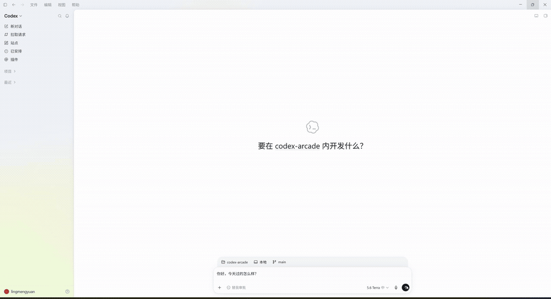
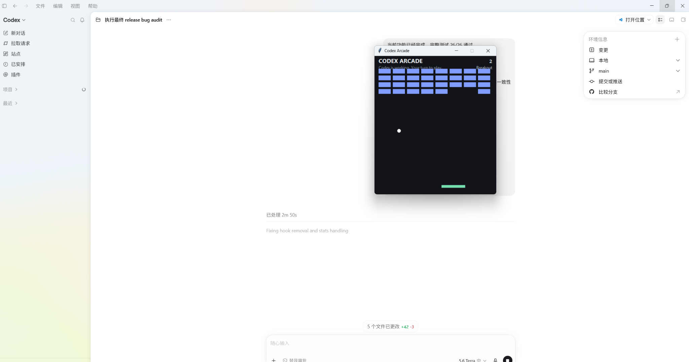

# 🎮 Codex Arcade

**Your AI works. You play.**

Prompt Codex → game pops up → Codex finishes → back to work.

[简体中文](README.zh-CN.md)



## Why?

I noticed that while Codex was working, I would often pick up my phone “for a second” — and keep scrolling long after Codex had already finished.

So I made this:

**Codex starts working → Arcade opens → Codex finishes → Arcade closes.**

## What you get

- 🎮 Snake, Dodge, Aim Trainer, Breakout, Pong
- 🔀 Switch or restart games anytime
- 🏆 Local stats, best scores, and 8 achievements
- 🌐 English / 简体中文
- 🔒 Fully local; no prompt, code, or project content is uploaded



## Install

Requires **Windows**, **Python 3.10+ with tkinter**, and **Codex Desktop**.

```bat
git clone https://github.com/lingmeng-658/codex-arcade.git
cd codex-arcade
python install.py
```

Then open:

**Codex Desktop → Settings → Hooks**

and approve the Codex Arcade hooks.

That’s it. Send Codex a task and Arcade will pop up if Codex is still working after about two seconds.

## Controls

| Key | Action |
| --- | --- |
| `P` / `Space` | Pause / resume |
| `R` | Restart |
| `N` | Random next game |
| `Tab` / `G` | Games list |
| `Esc` | Close Arcade |

Snake and Dodge use WASD / arrow keys. Aim Trainer uses the mouse.

## Privacy

Everything stays local.

Codex Arcade does **not** read or upload your prompts, code, or project files. Runtime data and stats are stored under `%LOCALAPPDATA%\CodexArcade`.

## Uninstall

```bat
python uninstall.py
```

To remove local stats too:

```bat
python uninstall.py --delete-data
```

## License

MIT. See [LICENSE](LICENSE).
